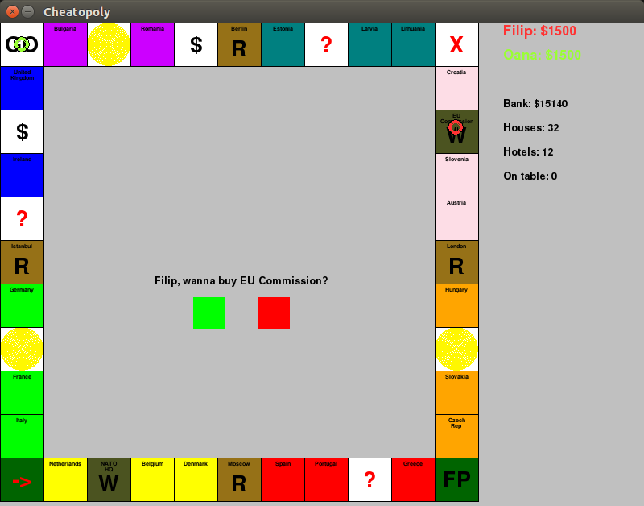
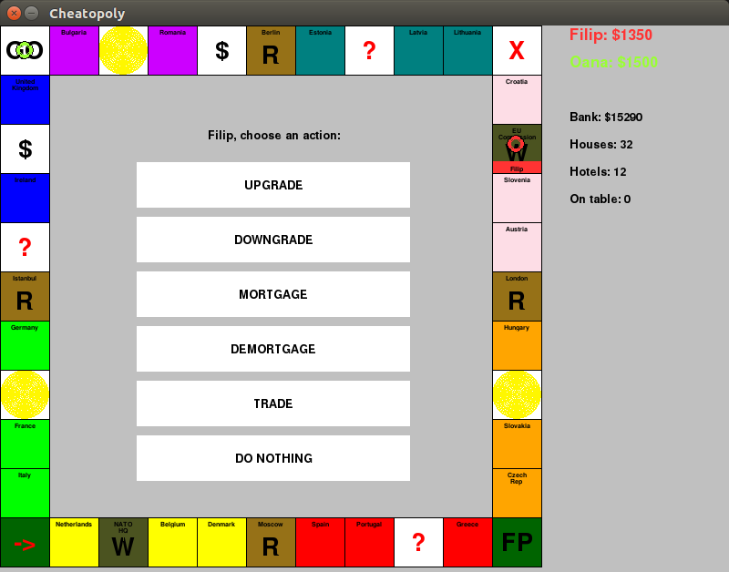

CHEATOPOLY
==========

This is a Monopoly clone in Python. I used it to learn the basics of object-oriented and GUI programming in Python 2. 

It is functional, but the interface has some minor quirks.

You can edit the data.txt file to customize the game.

Youtube demo
------------

You can see a recording of a game here: https://www.youtube.com/watch?v=Pos-jkR2nt4

Note that the recording uses the Monopoly names, but this repository uses names of European countries instead.

How to install on Ubuntu
------------------------

sudo apt-get update

sudo apt-get install python-pygame

How to install on Windows
------------------------

Install pygame from here: http://www.pygame.org/download.shtml

How to play
-----------

Open the console and type
> python2 Cheatopoly.py

Screenshots
-----------

